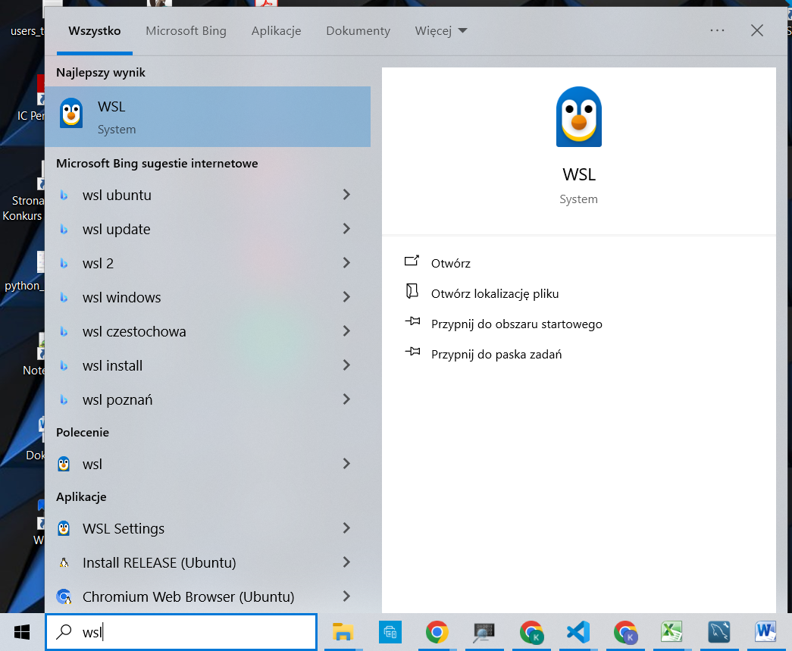
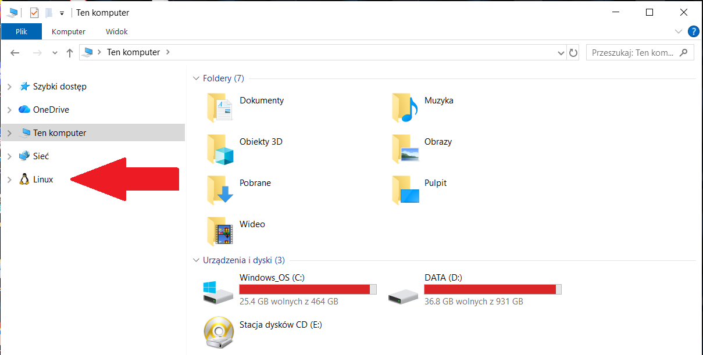
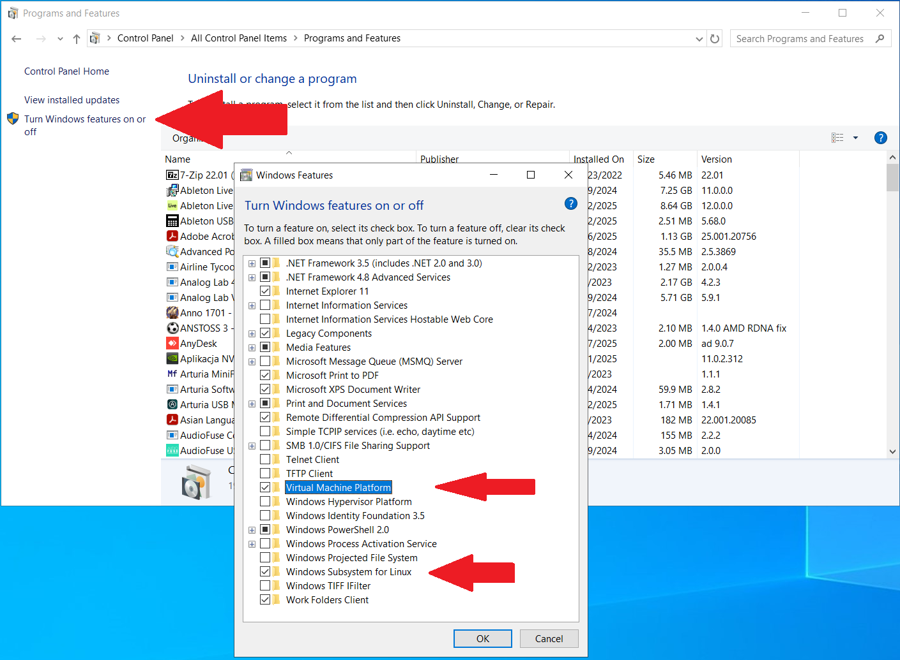

# Developer tools, 2025/2026

## Lab 3. Basic Linux commands - preparing WSL.

### 1. Configuration

We are currently working online, and the hardware configuration of individual users may vary, which may lead to a situation where it will not be possible to reproduce the original scenario, in which we use a virtual machine with Ubuntu and virtualization software in the form of Oracle Virtual Box in the computer lab.

So I decided on a different scenario for our next classes.

The vast majority of you work on computers with Windows installed, some of you with MacOS. In the latter case, the situation should be a bit simpler, as it is a UNIX-based system, which is also the ancestor of Linux, and there should be no major problems with executing the shell commands we want to learn.

For Windows systems, however, we need to perform the necessary configuration to work on **WSL (Windows Subsystem for Linux)**, which should be sufficient for us to start with. After moving to the computer lab at the University, we will implement the scenario with a virtual machine.

> **ATTENTION!** The following instructions apply only to Windows users!

The official installation documentation can be found at: https://learn.microsoft.com/en-us/windows/wsl/install

We will use it as a support.

**Step 1. Check if WSL is already installed.**

To make sure that installation is necessary, we will first check whether WSL is already installed.

In the command prompt (run it with administrator privileges), enter the command:

```powershell
wsl --list
```
If the command is not found, it means that `WSL` is not installed. You can also check its presence by searching for the phrase `WSL` in the Windows search box, as shown in the screenshots below.





If we cannot find these elements in our system, we proceed to the WSL installation.


**Step 2 (optional). WSL installation.**

**ATTENTION!**

Before executing the following command, make sure that the appropriate Windows options are enabled.

To do this, go to the Control Panel, then to Programs and Features, and select Turn Windows features on or off. Next, make sure that both options shown in the screenshot below are selected. If not, select them, and the installation will begin. You will then need to restart your computer.



The WSL should now install and you will be asked to perform system reboot.


**Step 3. Install Linux distribution.**

The following command will perform the installation of Ubuntu 22.04 on your machine. It may take a while as this system needs to be downloaded from the Internet.


```powershell
# default distributions
wsl --install

# or specific distribution
wsl.exe --install Ubuntu-22.04
```

Looking at the official documentation, we learn that it is possible to install different distributions, and the default is Ubuntu, which we will use in class.

**After installation, you will need to restart your computer.**

### 2. Learning bash.

Our next steps are to learn how to use Linux from the command line. Why do we need this? The vast majority of solutions available on the market today are based on Linux systems (cloud computing, Docker containers, application servers), which are configured to work efficiently and often do not have a graphical interface for their operation. Of course, many of these services are available from a web browser, but their configuration often requires at least a basic knowledge of `bash` shell commands.

In the world of programmers and devops, working with containers and technologies such as Docker, Kubernetes, and all kinds of application servers, databases, and caches is commonplace, and Linux containers reign supreme.

A description of how selected commands work and their applications can be found in lab number 4.

The configuration we have prepared will also be useful later on, when we discuss issues related to containerization.